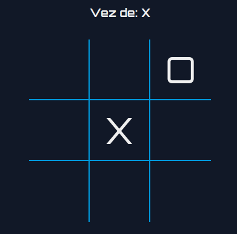
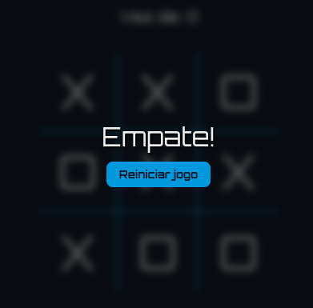

# GHash - Jogo da velha em React

Este projeto é um jogo da velha desenvolvido em React. O objetivo é implementar um jogo em que dois jogadores possam se enfrentar, sendo um com as peças "X" e o outro com as peças "O".

O jogo foi construído utilizando componentes React e o estado do jogo é gerenciado utilizando o hook `useState`. Além disso, a lógica do jogo foi implementada utilizando funções JavaScript.

## Como jogar

Para jogar, basta acessar a página do jogo e clicar em uma das células vazias do tabuleiro. O jogador atual será indicado no topo da tela. O jogo continuará até que um dos jogadores vença ou que o tabuleiro esteja completamente preenchido e não haja vencedor.

## Funcionalidades

O jogo apresenta as seguintes funcionalidades:

- Possibilidade de jogar com dois jogadores
- Indicação do jogador atual
- Indicação do vencedor
- Reinício do jogo após uma partida

## Como Instalar

1. Faça o download do projeto em seu computador ou clone o repositório usando o seguinte comando:

```
git clone https://github.com/Guilherme-Silva0/GHash.git
```

2. Abra o terminal no diretório do projeto e execute o seguinte comando para instalar as dependências:

```
npm install
```

3. Em seguida, execute o seguinte comando para iniciar a aplicação:

```
npm run dev
```

4. A aplicação será aberta em seu navegador no endereço [http://localhost:5173](http://localhost:5173).

## Contribuindo

Se desejar contribuir com o projeto, você pode abrir uma issue ou enviar um pull request. Toda ajuda é bem-vinda!

## Licença

Este projeto está sob a licença MIT. Veja o arquivo [LICENSE](https://github.com/Guilherme-Silva0/GHash/blob/master/LICENSE) para mais detalhes.

## Screeshots

- Tela inicial:
  

- Tela de resultado com campeão:
  

- Tela de resultado com empate:
  

## Tecnologias Utilizadas

O projeto GHash foi criado utilizando as seguintes tecnologias:

- React
- JavaScript
- HTML
- CSS

## Autor

O GHash foi criado por Guilherme-Silva0.

## Agradecimentos

- Obrigado à equipe do GitHub por fornecer uma plataforma incrível para hospedar projetos de código aberto.
- Obrigado aos desenvolvedores das tecnologias utilizadas neste projeto.
